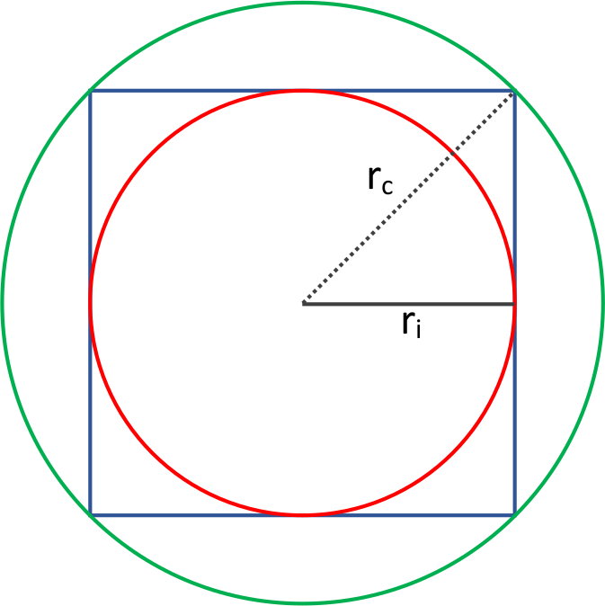

# Circonferenza inscritta e circoscritta

Dato il lato di un quadrato, il programma calcola il raggio della circonferenza inscritta e quello della circonferenza circoscritta.

## Obiettivo

Determinare i raggi delle due circonferenze associate a un quadrato, usando le proprietà geometriche del poligono regolare.

## Descrizione

La **circonferenza inscritta** in un quadrato è quella tangente ai quattro lati: il suo centro coincide con il centro del quadrato e il suo raggio è pari alla metà del lato:

$$r_i = \frac{l}{2}$$

La **circonferenza circoscritta** è quella che passa per i quattro vertici: il suo raggio è pari alla metà della diagonale del quadrato. Poiché la diagonale vale \(l\sqrt{2}\), si ha:

$$r_c = \frac{l\sqrt{2}}{2}$$

## Suggerimenti

- Includi `<math.h>` per usare la costante `sqrt(2.0)`.
- Le due formule sono semplici: derivano direttamente da metà lato e metà diagonale del quadrato.
- Verifica il programma con lato = 4: raggio inscritto atteso 2.0000, raggio circoscritto atteso ≈ 2.8284.
- Nota che il raggio circoscritto è sempre maggiore di quello inscritto: il rapporto tra i due è costante e vale \(\sqrt{2}\).

## Soluzione

  

    ▶
    Circonferenza inscritta e circoscritta
    <a
      class="onecompiler-external"
      href="https://onecompiler.com/c?hideNew=true&hideTitle=true&code=I2luY2x1ZGUgPHN0ZGlvLmg+CiNpbmNsdWRlIDxtYXRoLmg+CgppbnQgbWFpbigpIHsKICAgIGRvdWJsZSBsYXRvLCByX2luc2NyaXR0YSwgcl9jaXJjb3Njcml0dGE7CiAgICBwcmludGYoIkluc2VyaXNjaSBpbCBsYXRvIGRlbCBxdWFkcmF0bzogIik7CiAgICBzY2FuZigiJWxmIiwgJmxhdG8pOwogICAgcl9pbnNjcml0dGEgPSBsYXRvIC8gMi4wOwogICAgcl9jaXJjb3Njcml0dGEgPSAobGF0byAqIHNxcnQoMi4wKSkgLyAyLjA7CiAgICBwcmludGYoIlJhZ2dpbyBkZWxsYSBjaXJjb25mZXJlbnphIGluc2NyaXR0YTogICAgJS40ZlxuIiwgcl9pbnNjcml0dGEpOwogICAgcHJpbnRmKCJSYWdnaW8gZGVsbGEgY2lyY29uZmVyZW56YSBjaXJjb3Njcml0dGE6ICUuNGZcbiIsIHJfY2lyY29zY3JpdHRhKTsKICAgIHJldHVybiAwOwp9Cg=="
      target="_blank"
      rel="noopener noreferrer"
      title="Apri in una nuova scheda"
    >↗ Apri in grande</a>
  

  <iframe
    src="https://onecompiler.com/embed/c?hideNew=true&hideNewFileOption=true&hideTitle=true&theme=dark&fontSize=14&code=I2luY2x1ZGUgPHN0ZGlvLmg+CiNpbmNsdWRlIDxtYXRoLmg+CgppbnQgbWFpbigpIHsKICAgIGRvdWJsZSBsYXRvLCByX2luc2NyaXR0YSwgcl9jaXJjb3Njcml0dGE7CiAgICBwcmludGYoIkluc2VyaXNjaSBpbCBsYXRvIGRlbCBxdWFkcmF0bzogIik7CiAgICBzY2FuZigiJWxmIiwgJmxhdG8pOwogICAgcl9pbnNjcml0dGEgPSBsYXRvIC8gMi4wOwogICAgcl9jaXJjb3Njcml0dGEgPSAobGF0byAqIHNxcnQoMi4wKSkgLyAyLjA7CiAgICBwcmludGYoIlJhZ2dpbyBkZWxsYSBjaXJjb25mZXJlbnphIGluc2NyaXR0YTogICAgJS40ZlxuIiwgcl9pbnNjcml0dGEpOwogICAgcHJpbnRmKCJSYWdnaW8gZGVsbGEgY2lyY29uZmVyZW56YSBjaXJjb3Njcml0dGE6ICUuNGZcbiIsIHJfY2lyY29zY3JpdHRhKTsKICAgIHJldHVybiAwOwp9Cg=="
    width="100%"
    height="480"
    frameborder="0"
    allowfullscreen
    loading="lazy"
    title="Editor OneCompiler – Circonferenza inscritta e circoscritta"
  ></iframe>

